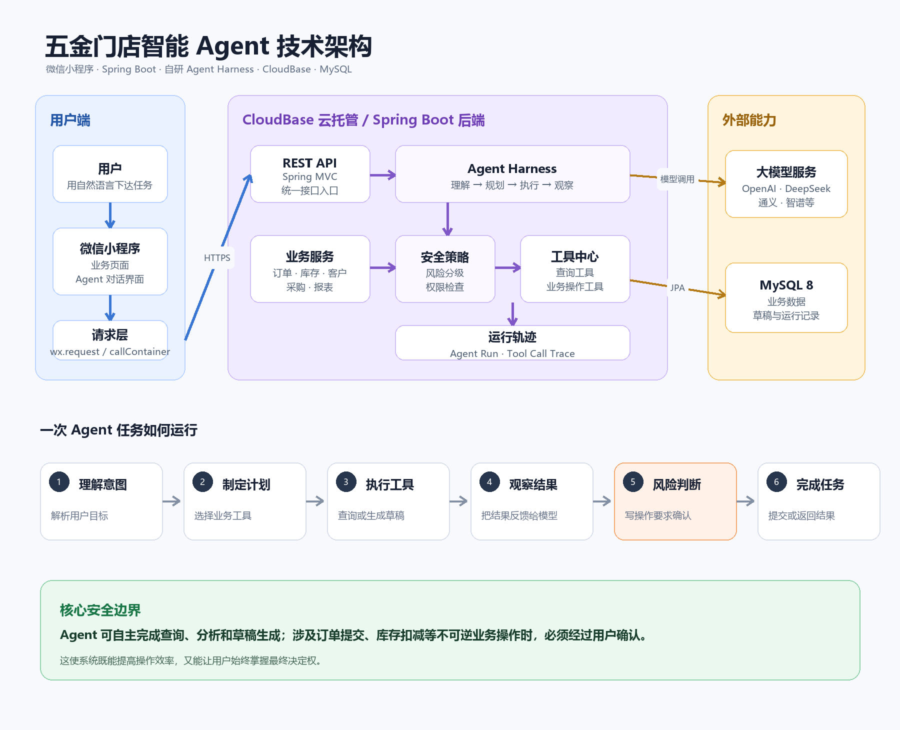

# 五金店经营 Agent 文档索引

## 1. 文档目的

本目录用于规划和维护五金店经营 Agent 的产品、技术与实施设计。当前阶段只完成设计，不代表相关能力已经实现。

Agent 的产品目标不是模拟用户点击小程序，而是让个体经营者通过自然语言、语音、图片和结构化确认卡片，更快完成查询、开单、补货和经营分析。

## 2. 已确认的设计原则

- 产品面向个体经营者，优先解决高频、重复、容易遗漏的经营操作。
- 微信小程序是交互入口，Spring Boot 业务服务是操作入口。
- Agent 只能调用白名单业务工具，不能直接访问 Repository 或写数据库。
- 使用有限、可暂停、可恢复的 Agent Loop。
- 查询工具可以自动调用；正式订单、出入库、收款等副作用操作必须经过策略校验和人工确认。
- 模型负责理解、选择工具和解释结果；Java 代码负责金额、库存、权限、事务、幂等和审计。
- 首期采用单 Agent，不引入多 Agent、通用代码沙箱和复杂向量知识库。
- Agent 不可用时，原有小程序业务页面必须仍可使用。

## 3. 文档地图

### 技术架构总览

[](./technical-architecture.png)

该图集中展示微信小程序、CloudBase 云托管、Spring Boot、Agent Harness、业务工具、大模型服务与 MySQL 之间的关系，以及一次 Agent 任务的执行与人工确认流程。

| 文档 | 内容 | 状态 |
| --- | --- | --- |
| [01-产品设计.md](./01-产品设计.md) | 用户、场景、价值、MVP 和产品指标 | 初稿 |
| [02-Harness技术设计.md](./02-Harness技术设计.md) | Agent Loop、工具、审批、状态和安全边界 | 初稿 |
| [03-数据与接口设计.md](./03-数据与接口设计.md) | Agent 数据表、接口、消息卡片和工具契约 | 初稿 |
| [04-MVP开发计划.md](./04-MVP开发计划.md) | 分阶段任务、验收标准、风险和开发顺序 | 初稿 |
| [05-CloudBase部署设计.md](./05-CloudBase部署设计.md) | 云托管、MySQL、环境变量和发布检查 | 初稿 |
| [06-Agent业务事实与记忆强化规范.md](./06-Agent业务事实与记忆强化规范.md) | 会话记忆、业务事实证据、Harness 强制校验与改造验收标准 | 待开发评审 |
| [07-Agent-Harness演进与治理方法论.md](./07-Agent-Harness演进与治理方法论.md) | Harness 持续演进、版本记录、ADR、评测、灰度发布和开源架构学习方法 | 建议采用 |
| [adr/ADR-0004-Agent工具执行采用管线与生命周期Hook.md](./adr/ADR-0004-Agent工具执行采用管线与生命周期Hook.md) | 工具执行管线、Hook 扩展边界与新增能力约束 | 已采用 |
| [adr/ADR-0005-Harness保持最小循环并拆分审批与上下文.md](./adr/ADR-0005-Harness保持最小循环并拆分审批与上下文.md) | 最小模型循环、审批状态机、上下文与结果组装边界 | 已采用 |

相关既有文档：

- [../设计.md](../设计.md)：现有进销存业务模块设计。
- [../页面设计.md](../页面设计.md)：现有小程序页面和交互设计。
- [../数据安全设计.md](../数据安全设计.md)：认证、事务、数据真源、审计和备份基线。
- [../数据库设计.md](../数据库设计.md)：现有数据库设计。

## 4. 产品范围

### 4.1 MVP 范围

- 文字输入。
- 商品、客户和库存查询。
- 商品与客户候选消歧。
- 历史成交价查询。
- 销售单草稿生成和修改。
- 人工确认后创建正式销售单。
- Agent 会话、运行、工具调用和审批日志。
- JPG/PNG/WEBP 订单图片与 XLS/XLSX/CSV 订单附件识别。
- 失败时回退到传统页面。

### 4.2 后续范围

- 语音开单。
- PDF、Word 和复杂版式票据识别。
- 用户商品别名与经营习惯记忆。
- 采购建议和采购草稿。
- 主动经营提醒。
- 客户欠款助手。
- 经营分析和日报。

### 4.3 暂不纳入

- 模拟点击微信小程序完成核心业务。
- 无人确认的出入库、收款、退款和删除。
- 自由执行 SQL、Shell 或任意网络请求。
- 多 Agent 自主协作。
- 为每个用户维护独立代码分支。

## 5. 文档维护规则

- 重要产品或架构决策应记录决策日期、理由和影响。
- 设计变更需要同步更新接口、数据和验收文档。
- 文档中的“计划”“建议”和“已实现”必须明确区分。
- 新工具必须同时补充风险等级、权限、幂等、确认和评测用例。
- 正式开发前，MVP 文档中的待确认事项必须完成评审。

## 6. 附件识别部署

小程序生产环境使用 CloudBase 云存储直传：`wx.cloud.uploadFile` 返回 `fileID`，再通过 `wx.cloud.callContainer` 通知后端读取和解析。无需配置旧的 `uploadFile` 公网合法域名。

附件默认保存到 `./data/agent-attachments` 的方式仅用于本地接口测试；如果其他客户端仍通过后端 multipart 上传，可切换为私有 COS：

```text
AGENT_ATTACHMENT_STORAGE=cos
COS_SECRET_ID=...
COS_SECRET_KEY=...
COS_REGION=ap-shanghai
COS_BUCKET=your-private-bucket-1250000000
```

Excel 和 CSV 由 Spring Boot 直接解析。图片需要先部署 [`tools/paddleocr-service`](../../tools/paddleocr-service/README.md)，然后设置：

```text
AGENT_ATTACHMENT_OCR_URL=http://paddleocr-service:8090/ocr
```

单个文件默认不超过 10MB，每条消息最多 3 个附件。附件内容会作为不可信业务数据交给模型，识别结果只能生成待确认草稿，不能绕过已有审批流程直接创建正式订单。

生产环境需确认 `CLOUDBASE_ENV_ID` 与小程序的 CloudBase 环境一致，并把云存储安全规则限制为当前小程序用户可写。后端只接受当前环境的 `cloud://` fileID，并只从 CloudBase/COS 官方域名读取短期下载地址。
