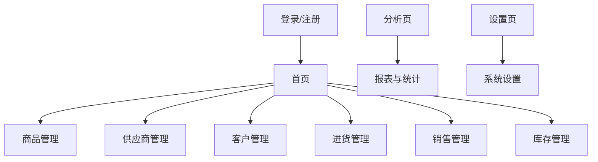
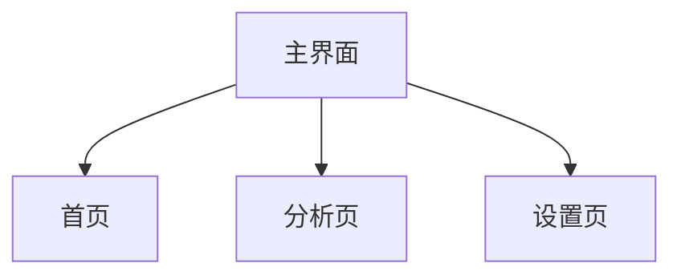

# 五金店管理系统原型设计

## 1. 主界面说明
主界面底部有三个主要按钮，分别为：
- 首页
- 分析页
- 设置页

页面底部采用Tab栏布局，用户可随时切换到首页、分析页或设置页。

## 2. 页面跳转结构示意

## 3. 主界面结构示意

---
如需继续细化各子页面原型，请告知具体页面名称或功能需求。

## 主界面说明
主界面底部有三个主要按钮，分别为：
- 首页
- 分析页
- 设置页

页面底部采用Tab栏布局，用户可随时切换到首页、分析页或设置页。

## 主界面结构示意

---
如需继续细化各子页面原型，请告知具体页面名称或功能需求。
