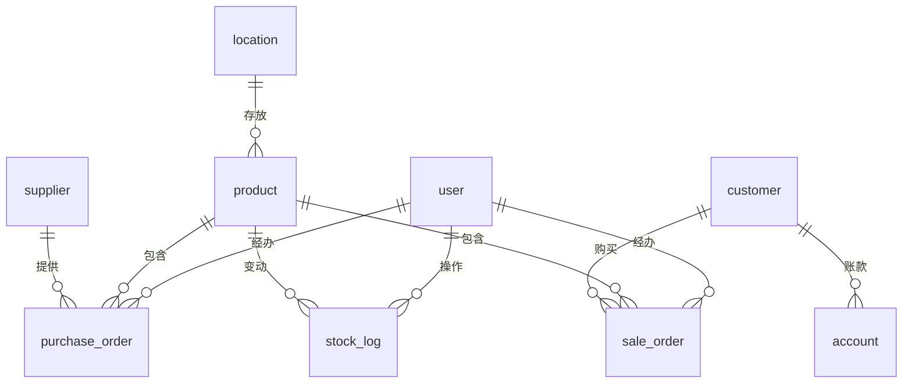

# 五金店管理系统数据库设计
// ...existing code...
## 一、数据库选型
- 微信小程序云开发推荐使用云数据库（MongoDB兼容）
- 如需自建后端，可选用MySQL、PostgreSQL等关系型数据库

## 二、主要数据表设计

### 1. 用户表（user）
| 字段名         | 类型         | 说明           |
| -------------- | ------------ | -------------- |
| _id            | string       | 主键           |
| openid         | string       | 微信openid     |
| phone          | string       | 手机号         |
| name           | string       | 姓名/昵称      |
| role           | string       | 角色（老板/店员/仓库/财务） |
| create_time    | datetime     | 创建时间       |

### 2. 商品表（product）
| 字段名         | 类型         | 说明           |
| -------------- | ------------ | -------------- |
| _id            | string       | 主键           |
| name           | string       | 商品名称       |
| barcode        | string       | 条码           |
| spec           | string       | 规格           |
| unit           | string       | 单位           |
| unit_convert   | object       | 单位换算       |
| retail_price   | number       | 零售价         |
| wholesale_price| number       | 批发价         |
| old_customer_price | number   | 老客户价       |
| cost_price     | number       | 进价           |
| stock          | number       | 库存数量       |
| location_id    | string       | 库位ID         |
| source_factory | string       | 源头厂商       |
| image_url      | string       | 商品图片       |
| status         | int          | 状态（1上架/0下架） |
| create_time    | datetime     | 创建时间       |

### 3. 供应商表（supplier）
| 字段名         | 类型         | 说明           |
| -------------- | ------------ | -------------- |
| _id            | string       | 主键           |
| name           | string       | 供应商名称     |
| contact        | string       | 联系人         |
| phone          | string       | 联系电话       |
| address        | string       | 地址           |
| remark         | string       | 备注           |
| create_time    | datetime     | 创建时间       |

### 4. 客户表（customer）
| 字段名         | 类型         | 说明           |
| -------------- | ------------ | -------------- |
| _id            | string       | 主键           |
| name           | string       | 客户名称       |
| type           | string       | 客户类型（C/B/老客户） |
| phone          | string       | 联系电话       |
| address        | string       | 地址           |
| debt           | number       | 当前欠款       |
| remark         | string       | 备注           |
| create_time    | datetime     | 创建时间       |

### 5. 采购单表（purchase_order）
| 字段名         | 类型         | 说明           |
| -------------- | ------------ | -------------- |
| _id            | string       | 主键           |
| supplier_id    | string       | 供应商ID       |
| operator_id    | string       | 经办人ID       |
| total_amount   | number       | 总金额         |
| status         | int          | 状态（0未入库/1已入库） |
| create_time    | datetime     | 创建时间       |
| items          | array<object>| 采购明细       |

#### 采购明细（items）
| 字段名         | 类型         | 说明           |
| -------------- | ------------ | -------------- |
| product_id     | string       | 商品ID         |
| quantity       | number       | 数量           |
| price          | number       | 实际成交单价   |
| amount         | number       | 金额           |

### 6. 销售单表（sale_order）
| 字段名         | 类型         | 说明           |
| -------------- | ------------ | -------------- |
| _id            | string       | 主键           |
| customer_id    | string       | 客户ID         |
| operator_id    | string       | 经办人ID       |
| total_amount   | number       | 总金额         |
| status         | int          | 状态（0未出库/1已出库） |
| pay_status     | int          | 支付状态（0未付/1已付/2部分） |
| create_time    | datetime     | 创建时间       |
| items          | array<object>| 销售明细       |

#### 销售明细（items）
| 字段名         | 类型         | 说明           |
| -------------- | ------------ | -------------- |
| product_id     | string       | 商品ID         |
| quantity       | number       | 数量           |
| price          | number       | 单价           |
| amount         | number       | 金额           |

### 7. 库存变动表（stock_log）
| 字段名         | 类型         | 说明           |
| -------------- | ------------ | -------------- |
| _id            | string       | 主键           |
| product_id     | string       | 商品ID         |
| change_type    | string       | 变动类型（入库/出库/盘点/调整） |
| quantity       | number       | 变动数量       |
| operator_id    | string       | 经办人ID       |
| order_id       | string       | 关联单据ID     |
| create_time    | datetime     | 创建时间       |

### 8. 库位表（location）
| 字段名         | 类型         | 说明           |
| -------------- | ------------ | -------------- |
| _id            | string       | 主键           |
| name           | string       | 库位名称       |
| area           | string       | 区域           |
| remark         | string       | 备注           |
| create_time    | datetime     | 创建时间       |

### 9. 账款表（account）
| 字段名         | 类型         | 说明           |
| -------------- | ------------ | -------------- |
| _id            | string       | 主键           |
| customer_id    | string       | 客户ID         |
| order_id       | string       | 关联订单ID     |
| amount         | number       | 欠款金额       |
| pay_time       | datetime     | 还款时间       |
| status         | int          | 状态（0未还/1已还） |
| create_time    | datetime     | 创建时间       |

## 三、ER图结构示意

---
如需详细字段说明或索引设计，请继续告知。