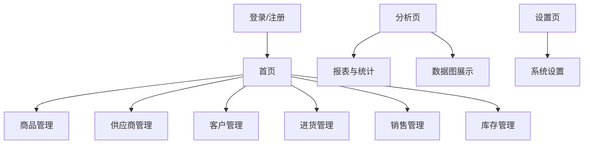

# 五金店管理系统微信小程序设计方案
// ...existing code...
## 一、系统架构
## 一、系统架构与技术栈
前端：
  - 微信小程序（WXML、WXSS、JavaScript/TypeScript）
  - 微信小程序原生API
  - 小程序UI框架（如Vant Weapp、ColorUI）

后端：
  - Java（Spring Boot 框架，RESTful API）
  - Spring MVC（Web接口开发）
  - Spring Data JPA 或 MyBatis（ORM/持久层）
  - Spring Security（权限与安全）
  - JWT（用户身份认证）
  - Lombok（简化Java代码）
  - Maven 或 Gradle（项目构建管理）

数据库与存储：
  - MySQL（推荐8.x版本）
  - Redis（可选，缓存/会话管理）
  - 阿里云OSS/腾讯云COS等对象存储

开发与部署：
  - Git（版本管理）
  - Postman（接口测试）
  - Docker（可选，容器化部署）
  - IDEA/VS Code（开发工具）

其他：
  - 微信支付/消息推送API
  - 单元测试（JUnit、Mockito）

## 三、技术要点（实习项目建议）
- 快捷入口（进货、销售、盘点、报表等）

### 3. 商品管理
- 商品列表、搜索、筛选
- 商品详情、编辑、上下架
- 条码/二维码生成与扫码识别
- 多规格、多单位支持

### 4. 供应商管理
- 供应商列表、详情、编辑
- 采购历史、价格趋势

### 5. 客户管理
- 客户列表、详情、编辑
- 赊账信息、订单历史

### 6. 进货管理
- 新建采购单（扫码/手动录入）
- 历史采购单查询
- 入库操作、库位分配、标签打印

### 7. 销售管理
- 新建销售单（扫码/搜索/选择）
- 自动报价、库存校验
- 欠款记录、收款操作
- 单据打印/微信推送

### 8. 库存管理
- 实时库存查询
- 库存盘点、差异处理
- 库存预警

### 9. 报表与统计与数据图
- 进销存日报、月报、年报
- 采购、销售、库存、财务统计
- 图表展示（如折线图、柱状图、饼图等数据可视化）
- 数据曲线、趋势分析
- 数据导出

### 10. 系统设置
- 用户管理、权限分配
- 数据备份与恢复
- 操作日志

## 三、技术要点
- Spring Boot 后端开发，提供RESTful API接口
- 微信小程序前端与后端API对接
- MySQL数据库设计与ORM（如MyBatis、JPA）
- 支持扫码（商品、库位、订单）
- 微信支付集成
- 微信消息推送（订单、库存、账款提醒）
- 响应式设计，适配不同手机屏幕
- 数据加密与权限校验（如JWT、Spring Security）

## 四、页面结构示意

## 五、开发流程建议
1. 需求梳理与原型设计
2. 数据库结构设计（MySQL）
3. Spring Boot 后端接口开发
  - 搭建基础Spring Boot工程（已完成）
  - 按照数据库结构，创建对应的实体类（Entity）
  - 编写数据访问层（Repository/Mapper）
  - 实现基础的业务逻辑（Service）
  - 开发RESTful接口（Controller）
  - 编写部分单元测试，保证基本功能可用
4. 小程序页面开发
5. 权限与安全实现（如JWT/Spring Security）
6. 测试与优化
7. 上线与运维

---
如需详细数据库设计或页面原型，请继续告知。