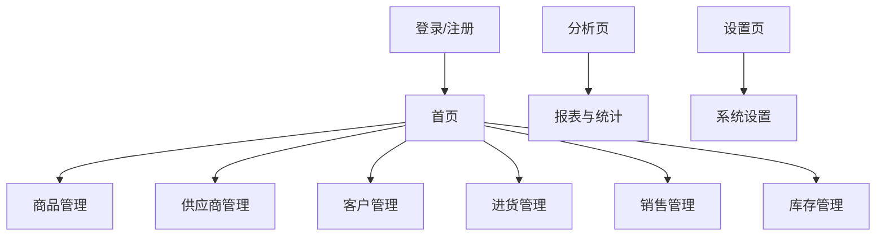

# 五金店管理系统页面设计

本文档用于承接 [设计.md](/F:/Hardware-Store-Management-System/Hardware-Store-Management-System/docs/设计.md) 中的页面与交互设计内容，重点描述页面结构、主要元素、用户操作流程和后续扩展方向。

## 一、页面结构示意

## 二、商品管理模块页面设计

### 1. 商品列表页
页面作用：
- 展示商品数据
- 提供搜索、筛选、查看详情、编辑、上下架、删除等入口

页面元素：
- 搜索框：按商品名称、条码、规格、厂商模糊搜索
- 状态筛选：全部、上架、下架
- 商品列表字段：商品名称、条码、规格、单位、零售价、库存数量、库位、厂商、状态
- 操作按钮：查看详情、编辑、上下架、删除、新增商品

页面交互建议：
- 默认展示商品列表
- 支持关键字查询和状态筛选联动
- 点击商品进入详情页
- 点击新增商品进入新增页

### 2. 商品详情页
页面作用：
- 查看单个商品完整信息

展示字段：
- 商品名称、条码、规格、单位、单位换算
- 零售价、批发价、老客户价、进价
- 库存数量、库位 ID
- 源头厂商、图片地址、状态、创建时间

页面交互建议：
- 支持从列表页跳转进入
- 支持点击编辑按钮跳转到编辑页

### 3. 商品新增页
页面作用：
- 新建商品信息

录入字段：
- 名称、条码、规格、单位、单位换算
- 零售价、批发价、老客户价、进价
- 库存数量、库位 ID、源头厂商、图片地址、状态

页面交互规则：
- 未填写状态默认上架
- 未填写库存默认 0
- 保存成功后返回列表页或进入详情页

### 4. 商品编辑页
页面作用：
- 修改已有商品信息

录入字段：
- 与新增页一致

页面交互规则：
- 编辑时自动加载原始数据
- 保存后返回详情页或列表页

## 三、供应商管理模块页面设计

### 1. 供应商列表页
页面作用：
- 展示供应商基础信息
- 提供详情、编辑、删除、查看采购历史入口

页面元素：
- 搜索框：按供应商名称、联系人、电话搜索
- 列表字段：供应商名称、联系人、电话、地址、创建时间
- 操作按钮：查看详情、编辑、删除、采购历史、新增供应商

页面交互建议：
- 支持快速搜索供应商
- 点击采购历史进入该供应商关联采购单页面

### 2. 供应商详情页
页面作用：
- 查看供应商完整资料和合作情况

展示内容：
- 基础信息：名称、联系人、电话、地址、备注
- 统计信息：采购次数、累计采购金额、最近采购时间
- 扩展信息：价格趋势入口、采购历史入口

### 3. 供应商新增/编辑页
页面作用：
- 录入或修改供应商信息

录入字段：
- 名称、联系人、电话、地址、备注

页面交互规则：
- 名称为重点字段
- 保存成功后返回供应商列表或详情页

## 四、客户管理模块页面设计

### 1. 客户列表页
页面作用：
- 展示客户信息和欠款概况

页面元素：
- 搜索框：按客户名称、电话搜索
- 类型筛选：C 端、B 端、老客户
- 列表字段：客户名称、类型、电话、地址、当前欠款、创建时间
- 操作按钮：查看详情、编辑、删除、订单历史、欠款记录、新增客户

### 2. 客户详情页
页面作用：
- 查看客户资料、订单历史和欠款情况

展示内容：
- 基础信息：名称、类型、电话、地址、备注
- 财务信息：当前欠款、最近回款时间
- 业务信息：订单历史、消费次数、累计金额

### 3. 客户新增/编辑页
页面作用：
- 录入或修改客户信息

录入字段：
- 名称、类型、电话、地址、备注

页面交互规则：
- 客户类型影响后续价格策略提示
- 保存后返回客户列表或详情页

## 五、进货管理模块页面设计

### 1. 采购单列表页
页面作用：
- 查看采购单记录和入库状态

页面元素：
- 筛选条件：供应商、状态、日期范围
- 列表字段：采购单号、供应商、下单时间、总金额、状态、经办人
- 操作按钮：查看详情、编辑、确认入库、新建采购单

### 2. 新建采购单页
页面作用：
- 录入采购单主信息和商品明细

页面元素：
- 基础区域：供应商、下单时间、经办人、备注
- 明细区域：商品、数量、单价、金额、库位
- 汇总区域：总金额

页面交互规则：
- 支持新增多条商品明细
- 自动汇总总金额
- 入库前可继续修改

### 3. 采购单详情页
页面作用：
- 查看采购单详情和入库结果

展示内容：
- 采购单基础信息
- 商品明细
- 入库状态
- 关联库存更新信息

### 4. 入库确认页
页面作用：
- 确认采购单入库并分配库位

页面交互建议：
- 支持逐条确认商品数量与库位
- 提交后更新库存并生成入库日志

## 六、销售管理模块页面设计

### 1. 销售单列表页
页面作用：
- 查看销售单和收款状态

页面元素：
- 筛选条件：客户、状态、支付状态、日期范围
- 列表字段：销售单号、客户、下单时间、总金额、支付状态、出库状态
- 操作按钮：查看详情、编辑、确认出库、收款登记、新建销售单

### 2. 新建销售单页
页面作用：
- 创建销售订单

页面元素：
- 基础区域：客户、下单时间、经办人
- 明细区域：商品、数量、自动带出价格、金额
- 结算区域：总金额、已收金额、欠款金额、支付状态

页面交互规则：
- 根据客户类型自动带出零售价、批发价或老客户价
- 下单前提示库存是否充足

### 3. 销售单详情页
页面作用：
- 查看销售单详情、发货状态和收款情况

展示内容：
- 销售单基础信息
- 商品明细
- 应收、已收、欠款信息
- 出库记录

### 4. 收款登记页
页面作用：
- 记录客户收款操作

页面元素：
- 销售单信息
- 应收金额、已收金额、当前收款金额
- 收款方式、备注

页面交互规则：
- 提交后自动更新支付状态
- 支持部分收款

## 七、库存管理模块页面设计

### 1. 库存列表页
页面作用：
- 实时查看库存与库位分布

页面元素：
- 搜索框：按商品名称、条码搜索
- 筛选条件：库位、预警状态
- 列表字段：商品名称、库存数量、预警阈值、库位、最后更新时间
- 操作按钮：查看详情、盘点调整、查看日志

### 2. 库存详情页
页面作用：
- 查看单个商品库存信息与变动历史

展示内容：
- 商品基础信息
- 当前库存、库位、预警阈值
- 最近入库、出库、盘点、调整记录

### 3. 盘点调整页
页面作用：
- 录入盘点结果并生成库存差异记录

页面元素：
- 系统库存
- 实盘库存
- 差异数量
- 差异原因

页面交互规则：
- 提交后自动生成库存日志
- 更新库存数量和最后更新时间

### 4. 库存预警页
页面作用：
- 集中展示低库存商品

页面元素：
- 低库存商品列表
- 当前库存、预警阈值、建议补货量
- 跳转采购入口

## 八、报表与统计模块页面设计

### 1. 报表首页
页面作用：
- 汇总展示经营核心指标

页面元素：
- 时间筛选：日、月、年、自定义区间
- 核心卡片：采购总额、销售总额、毛利估算、应收账款、低库存数量
- 快捷入口：日报、月报、年报、图表分析、导出

### 2. 统计分析页
页面作用：
- 展示采购、销售、库存的多维统计结果

页面元素：
- 折线图：销售趋势、采购趋势
- 柱状图：商品销量排行、采购金额排行
- 饼图：客户类型占比、库存结构占比

### 3. 报表明细页
页面作用：
- 查看具体统计明细数据

页面内容：
- 数据表格
- 筛选条件回显
- 导出按钮

### 4. 数据导出页
页面作用：
- 按条件导出经营数据

页面交互建议：
- 支持导出日报、月报、销售明细、采购明细、库存明细

## 九、系统设置模块页面设计

### 1. 设置首页
页面作用：
- 作为系统管理入口页

页面元素：
- 用户管理
- 权限设置
- 数据备份与恢复
- 操作日志
- 系统参数

### 2. 用户管理页
页面作用：
- 维护系统账号

页面元素：
- 用户列表：账号、姓名、手机号、角色、状态、创建时间
- 操作按钮：新增、编辑、启用、停用、重置密码

### 3. 角色权限页
页面作用：
- 配置角色和访问权限

页面元素：
- 角色列表：老板、店员、仓库、财务
- 权限勾选区域：商品、供应商、客户、采购、销售、库存、报表、系统设置

### 4. 备份恢复页
页面作用：
- 执行数据备份与恢复

页面元素：
- 备份记录列表
- 立即备份按钮
- 上传恢复文件按钮

### 5. 操作日志页
页面作用：
- 查询关键操作行为

页面元素：
- 筛选条件：操作人、模块、日期范围
- 日志列表：操作时间、操作人、模块、动作、详情

## 十、后续页面扩展建议
- 增加统一顶部搜索与消息提醒
- 增加首页快捷入口和经营概览
- 增加移动端适配的卡片式布局
- 增加扫码录入、打印、分享和通知能力
- 增加图表交互联动和多维筛选

---
如需继续补充页面原型图说明、页面跳转流程图或小程序目录结构，可在本文件基础上继续扩展。
